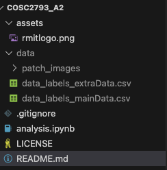

# Classify Images of Colon Cancer

* **Course:** COSC2973 Computational Machine Learning
* **Instructor:** Dr Azadeh Alavi, Dr Pubudu Sanjeevani
* **Members:**
   - Bao Ly Ngoc Gia (s3634975)
   - Hoang Vu Nguyen (s4020628)
The repository contains the development code for the assignment 2 COSC2973 Computational Machine Learning. For this assignment, Task 1: classify the images of colon cancer is the main topic. 

 

    
 

 # Details file
 As the analysis of task is quite long, so separate Jyputer Notebook will be developed. Then, combine and merge as the final one.

# Load the data
The given dataset in [Canvas](https://rmit.instructure.com/courses/140920/assignments/1063663) will be used. To make the script works, place it in the data folder. As the data is large, so do not commit it
on GitHub

Example of project structure:
 

    
 

 The given data is divided into the train and test sets and saved into the (./data/test.csv and ./data/train.csv) files. The logic and explanation of the decision can be found in ``data_splitting.ipynb`` file. 
 The ``./data/train.csv`` file is used to train the classifiers. And the test is used to perform final evaluation. 

 > [!NOTE]
> These data are not processed (i.e. normalizing, or data augmentation). 

 # Full report structure
 Since the report will be submitted in one Jupyter Notebook only, then the current notebooks are merged in the following order:
 
 1. data_splitting.ipynb
 2. analysis.ipynb
 3. cancerous_clf.ipynb
 4. cell_type_clf.ipynb
 
 Once the notebooks are merged, the content for **introduction**, **conclusions** and **references** must be added.
